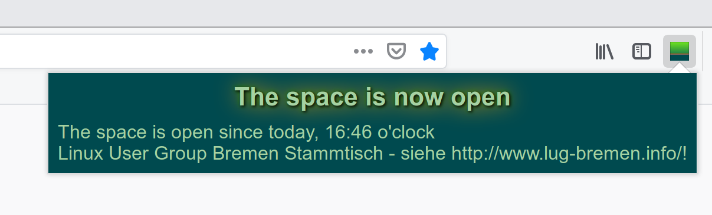

# HSHB OSN WebExtension

A WebExtension for the OpenSpaceNotifier of the Hackerspace Bremen e.V.

# Developed by

- [ccoors](https://www.ccoors.de/)

# Build

Install `web-ext` and run this in your checked out repo:

    $ cd webextension
    $ web-ext build --overwrite-dest

The extension can then be found in `webextension/web-ext-artifacts`.

# Why?

The [original WebExtension](https://github.com/HackerspaceBremen/osn_chrome_ext) only works in Google Chrome, this Extension works in

- Firefox (https://addons.mozilla.org/de/firefox/addon/hshb-openspacenotifier/)
- Chromium
- Google Chrome

Not officially supported (because [the WebExtension Polyfill](https://github.com/mozilla/webextension-polyfill) only unofficially supports them) is Opera and the Vivaldi Browser, although they appear to work.

MS Edge is not supported. Might change if [this issue](https://github.com/mozilla/webextension-polyfill/issues/3) is  resolved.

# Features

- English/German
- Browser button
- Notify on space open/close
- Notify on status message change

# License

GPLv3 or later.
